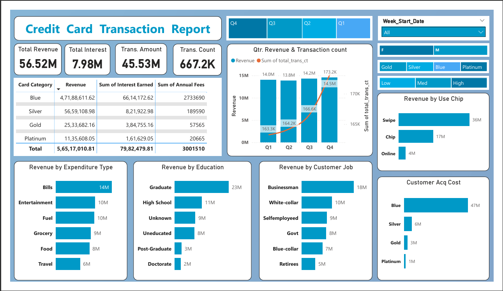
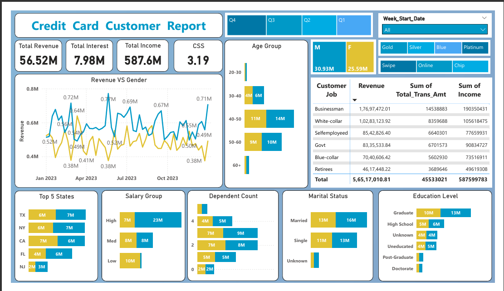

# 💳 Credit Card Transaction Analysis (Power BI + SQL)

This project presents a **comprehensive Credit Card Transaction Analysis Dashboard** built using **Power BI** and **SQL**, designed to uncover actionable insights into customer spending behavior, card performance, and revenue trends.  
It showcases an **end-to-end data analytics workflow** — from raw data cleaning to real-time interactive reporting.

---

## 🎯 Project Objective

To analyze **credit card transaction and customer data** to identify:
- Revenue trends and business growth drivers  
- Customer demographics and spending behavior  
- Card type performance (Blue, Silver, Gold, Platinum)  
- High-value customer segments and preferred payment methods  

---

## 🛠️ Tech Stack

| Tool | Purpose |
|------|----------|
| **Power BI** | Dashboard creation, DAX calculations, visualization |
| **Power Query** | Data cleaning and transformation |
| **SQL (MySQL / SQL Server)** | Data storage and real-time updates |
| **Excel / CSV** | Raw and incremental data input |
| **DAX** | Custom KPIs and measures |

---

## 📂 Project Structure

```
├── credit_card_data.zip       # Contains all 4 CSV files (credit_card.csv, customer.csv, cc_add.csv, cust_add.csv)
├── SQL_create_table_Query.txt # SQL script to create database tables
├── credit_card_report.pbix    # Power BI report file
├── credit_card_report.pdf     # PDF version of dashboards
├── 📁 Screenshots
│ ├── Customer_Report.png
│ └── Transaction_Report.png
└── README.md
```

---

## 📈 Data Description
- **credit_card.csv / cc_add.csv** → Transaction-level data including Date, Card Type, Amount, Interest, and City.  
- **customer.csv / cust_add.csv** → Customer demographics such as Age, Gender, Occupation, Income, and Card Category.  
- Each new week’s data in `*_add.csv` ensures the dashboard reflects **real-time updates**.

---

## 🧩 Project Workflow

1. **Data Cleaning & Preparation (Power Query)**
   - Cleaned and transformed raw CSV files (`credit_card.csv`, `customer.csv`) using Power Query.
   - Handled missing values, corrected data types, and standardized columns.

2. **Database Creation (SQL Integration)**
   - Designed SQL schema using `SQL_create_table_Query.txt`.
   - Imported cleaned data into SQL tables for structured storage and scalability.

3. **Real-Time Data Update**
   - Added new weekly data (`cc_add.csv`, `cust_add.csv`) into SQL tables.
   - Connected Power BI to the SQL database for **real-time dashboard updates**.

4. **Data Modeling & DAX**
   - Built data relationships and created DAX measures for KPIs:
     - Total Revenue  
     - Total Interest  
     - Transaction Count  
     - Transaction Amount  
     - Customer Satisfaction Score (CSS)

5. **Dashboard Development (Power BI)**
   - Designed two dashboards for clear, actionable insights:
     - 📊 **Credit Card Transaction Report**
     - 👥 **Credit Card Customer Report**

---


## 📊 Dashboard Insights

### 🧾 Credit Card Transaction Report
- **Total Transactions & Revenue** show steady monthly growth, indicating rising card usage.  
- **Platinum and Gold cards** contribute the highest revenue share.  
- **Weekend transactions** are notably higher, suggesting leisure-related spending patterns.  
- **Top-performing cities** contribute a majority of total transaction volume.

### 👥 Credit Card Customer Report
- **Customer Age Group 30–40** has the largest active user base.  
- **Male customers** contribute slightly higher total spending than female customers.  
- **Salaried individuals** dominate credit card usage and show high repayment rates.  
- **New customers** added weekly reflect positive customer acquisition trends.

---

## 🧩 Key Features

- ✅ End-to-End ETL Process (Extract → Transform → Load)  
- ✅ Real-Time Data Updates from SQL  
- ✅ Data Modeling & DAX Calculations  
- ✅ Interactive Power BI Dashboards  
- ✅ PDF & Image Reports for presentation  
- ✅ Professional Data Storytelling

---

## 📊 Dashboard Previews

#### 🔹 Credit Card Transaction Report


#### 🔹 Credit Card Customer Report


---

## 💡 Business Impact

This analysis helps financial institutions:
- Identify **high-value customers** for targeted marketing campaigns.  
- Understand **spending behavior** to design better card offers.  
- Track **performance by card type and geography**.  
- Enable **real-time insights** for business decision-making using SQL–Power BI connectivity.

---

## 🧰 Skills Demonstrated
- Data Cleaning & Transformation (Power Query)
- SQL Integration & Data Modeling
- DAX Calculations for KPIs
- Dashboard Design & Data Storytelling
- Real-Time BI using Power BI + SQL

---

## 🚀 Key Learnings

- Building **end-to-end BI projects** from raw data to insights.  
- Integrating **SQL and Power BI** for **real-time analytics**.  
- Applying **DAX** to calculate KPIs and dynamic visuals.  
- Interpreting **business performance metrics** effectively.  

---

## 🧠 Author

**👤 Harsh Belekar**  
📍 Data Analyst | Python | SQL | Power BI | Excel | Data Visualization  
🔗 [LinkedIn](https://www.linkedin.com/in/harshbelekar) | [GitHub](https://github.com/Harsh-Belekar)

📧 **harshbelekar74@gmail.com**


---

## 🏷️ Repository Topics

powerbi sql data-analysis dashboard business-intelligence
credit-card data-visualization analytics dax power-query

---

⭐ *If you liked this project, don’t forget to star the repo and connect with me on LinkedIn!*

